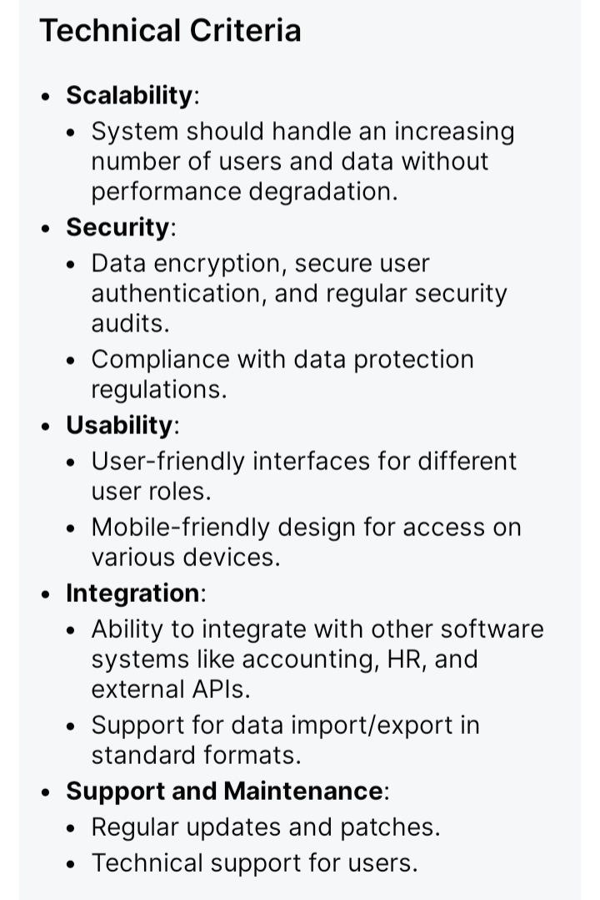
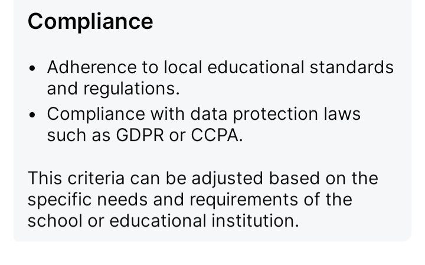

# Maktab Boshqaruv Tizimi

## Xususiyatlar
- [Maktab Boshqaruv Tizimi](#maktab-boshqaruv-tizimi)
  - [Xususiyatlar](#xususiyatlar)
    - [O'quvchilar ma'lumotlarini boshqarish](#oquvchilar-malumotlarini-boshqarish)
    - [O'qituvchi ma'lumotlarini boshqarish](#oqituvchi-malumotlarini-boshqarish)
    - [Sinf boshqaruvi](#sinf-boshqaruvi)
    - [Davomatni boshqarish](#davomatni-boshqarish)
    - [Imtihon va baholarni boshqarish](#imtihon-va-baholarni-boshqarish)
    - [Vaqt jadvalini boshqarish](#vaqt-jadvalini-boshqarish)
    - [To'lovlarni boshqarish](#tolovlarni-boshqarish)
    - [Kutubxona boshqaruvi](#kutubxona-boshqaruvi)
    - [Transport boshqaruvi](#transport-boshqaruvi)
    - [Aloqa vositalari](#aloqa-vositalari)
    - [Foydalanuvchi boshqaruvi](#foydalanuvchi-boshqaruvi)
    - [Hisobotlar va tahlillar](#hisobotlar-va-tahlillar)
    - [Texnik mezonlar](#texnik-mezonlar)
    - [Muvofiqlik](#muvofiqlik)

### O'quvchilar ma'lumotlarini boshqarish
- O'quvchi profillarini shaxsiy, akademik va davomat ma'lumotlari bilan yuritish.
- O'quvchilarning ro'yxatga olinish holati va tarixini kuzatib borish.

### O'qituvchi ma'lumotlarini boshqarish
- O'qituvchilar uchun shaxsiy ma'lumotlarni, malaka ma'lumotlarini va jadval ma'lumotlarini o'z ichiga oluvchi profillar.
- O'qituvchining davomati va ish faoliyatini kuzatib borish

### Sinf boshqaruvi
- Sinflar va bo'limlarni yaratish va boshqarish
- O'qituvchilar va o'quvchilarni sinflarga biriktirish

### Davomatni boshqarish
- O'quvchilar va xodimlarning kunlik davomatini yozib borish
- Davomatlar hisobotlarini generate qilish

### Imtihon va baholarni boshqarish
- Imtihonlarni rejalashtirish va imtihon natijalarini boshqarish
- Hisobot kartalari va transkriptlarni generate qilish

### Vaqt jadvalini boshqarish
- Sinflar va o'qituvchilar uchun vaqt jadvallarini yaratish va boshqarish
- Vaqt jadvali ziddiyatlari va tuzatishlarini boshqarish

### To'lovlarni boshqarish
- O'quvchilar toʻlovlarini, toʻlov jadvallarini boshqarish va toʻlov holatini kuzatib borish
- To'lov kvitantsiyalari va moliyaviy hisobotlarni generate qilish

### Kutubxona boshqaruvi
- Kitoblar va boshqa manbalar ro'yxatini yuritish
- Kitoblarning berilishi va qaytarilishini kuzatib borish

### Transport boshqaruvi
- Maktab transport marshrutlarini, jadvallarini va tayinlangan o'quvchilarni boshqarish
- Transport haqlari va ular to'lovini kuzatib borish

### Aloqa vositalari
- Ota-onalar, o'quvchilar va xodimlarga bildirishnomalar va ogohlantirishlarni yuborish
- Ichki xabarlar va e'lonlarni boshqarish

### Foydalanuvchi boshqaruvi
- Administratorlar, o'qituvchilar, o'quvchilar va ota-onalar uchun rolga asoslangan kirish nazorati
- Xavfsiz login va autentifikatsiya tizimlari

### Hisobotlar va tahlillar
- Maktabning turli jihatlari bo'yicha batafsil hisobotlarni generate qilish
- Ish faoliyatini monitoring qilish va qaror qabul qilish uchun tahlil

### Texnik mezonlar

### Muvofiqlik
